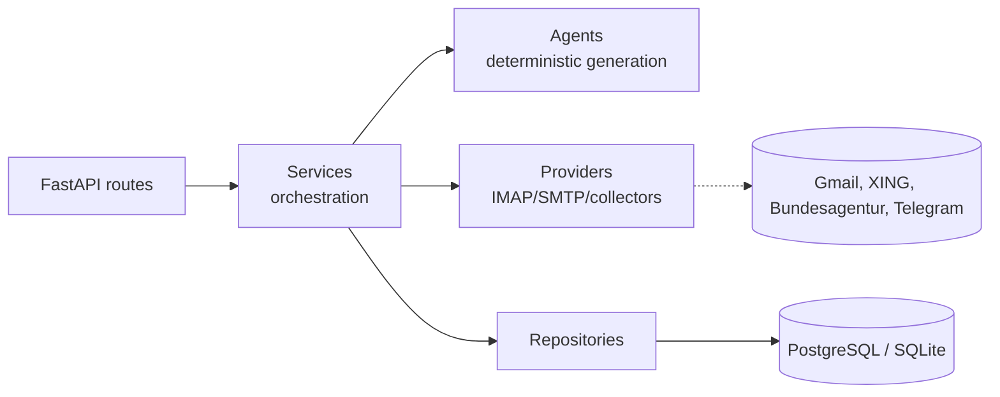

# JobTriage — AI-Assisted Job Application Automation Platform

An API-driven backend that collects job postings, scores them against a candidate profile, drafts CVs/cover letters/email responses, and tracks the whole application lifecycle — with every send-capable action gated behind explicit human approval. Built with FastAPI, SQLAlchemy, Alembic, and PostgreSQL/SQLite.

> Formerly "AI Job Search Control Center" — see `docs/DEVELOPMENT_HISTORY.md` for the full stage-by-stage build log.

## What it does

- Collects job postings from the Bundesagentur für Arbeit API and a XING email digest mailbox, deduplicates them, and scores them against a candidate profile.
- Notifies via Telegram (bot commands + optional daily digest).
- Generates tailored CV drafts, cover-letter ("Bewerbung") drafts, and email response/follow-up drafts — all **deterministic, template-based generation**, not free-form LLM output, so content is traceable to specific candidate facts and job data.
- Syncs a Gmail inbox read-only, matches incoming messages to jobs/applications, classifies them, and proposes response drafts and follow-ups.
- **Never sends anything — email, application, or otherwise — without an explicit human approval step recorded in the database first.**
- Runs an optional automation scheduler (a separate process, not baked into the API's request-handling workers) that ticks collectors, drafting, and the daily digest on an interval.

## Why I built it

Job searching involves a lot of repetitive, low-judgment work (tracking postings, drafting first-pass responses, remembering to follow up) mixed with decisions that genuinely need a human (does this job actually fit, should this reply actually go out). This project automates the first category and builds explicit, code-enforced gates — not just UI conventions — around the second, while using it as a vehicle to practice production-grade backend engineering: real concurrency control, real migration discipline, real integration testing against PostgreSQL, and a hard boundary around trusting content from unauthenticated inbound email.

## Key features

- **Job collectors**: Bundesagentur für Arbeit REST API, XING email digest (IMAP), each independently replaceable behind a common interface.
- **Deterministic drafting agents**: CV adaptation, cover-letter generation, email response/follow-up drafts — rule-based and template-driven, not LLM calls, so every generated fact traces back to a stored, trusted source.
- **Human-approval gate**: every outbound email (response or follow-up) requires a persisted `APPROVED` decision before a send is even attempted; enforced in code (`app/services/response_draft_send.py`, `app/services/follow_up_send.py`), not just documented.
- **Trust/provenance model**: job facts and candidate facts each carry a trust classification; only trusted-source data can reach generated text (see `docs/SECURITY_MODEL.md`).
- **Automation scheduler**: a standalone worker process with database-enforced lease + compare-and-swap locking, so it's safe even if accidentally run more than once — see `docs/ARCHITECTURE.md`.
- **IMAP hardening**: bounded wall-clock deadlines on every phase of an IMAP session (DNS, connect, TLS, each command), with DNS resolution isolated in a child process specifically because a blocked DNS call can't otherwise be forcibly cancelled from Python.
- **Telegram control center**: bot commands to trigger collectors, review/approve drafts, and check status, plus an optional daily digest.

## Architecture



Full map with trust boundaries, transaction boundaries, and dependency-direction review: **`docs/ARCHITECTURE.md`**.

## Tech stack

FastAPI · SQLAlchemy 2.x · Alembic · Pydantic v2 / pydantic-settings · PostgreSQL (production) / SQLite (dev) · python-telegram-bot · pytest · Ruff · Docker + Compose · GitHub Actions CI (including a real PostgreSQL integration job).

## Engineering highlights

- **Migration discipline**: every schema change ships with a matching Alembic migration; CI proves the full migration chain actually reaches head against a real PostgreSQL database (not `Base.metadata.create_all()`, which would silently paper over a broken chain).
- **Concurrency correctness**: automation runs use a partial unique index + lease + heartbeat to guarantee at most one running cycle per account; schedule claiming uses an atomic compare-and-swap `UPDATE`; both are verified under real PostgreSQL concurrency in dedicated integration tests, not just SQLite.
- **Idempotency everywhere it matters**: unique-constraint-backed send records mean re-running a step never double-sends; ambiguous outcomes get a terminal `UNCERTAIN` state instead of a guessed retry.
- **Retryable vs. permanent failure classification**: IMAP/SMTP/collector failures are explicitly classified so transient errors retry and structural ones don't get retried forever.
- **1900+ tests**, including PostgreSQL-only concurrency integration tests that self-skip locally and always run in CI.

## Safety / human approval

- No outbound email is ever sent without a persisted, explicit approval record.
- No job-application submission automation exists or is planned without an officially supported interface and explicit user approval per action.
- Inbound email content (from XING digests, from Gmail replies) is never trusted as generation input beyond template/language selection — see `docs/SECURITY_MODEL.md` for the full trust model.
- Full breakdown of what's implemented vs. what's a deployment responsibility vs. what's future hardening: **`docs/SECURITY_MODEL.md`**.

## Testing

```bash
pytest -q                                    # full suite (SQLite)
ruff check app tests alembic
ruff format --check app tests alembic
```

CI additionally runs a dedicated job against a real PostgreSQL service container: the Alembic migration chain must reach head, and two concurrency-specific integration test modules run against it (see `.github/workflows/ci.yml`).

## Quick start

```bash
python -m venv .venv
source .venv/bin/activate        # Windows: .venv\Scripts\activate
pip install -e ".[dev]"
cp .env.example .env
alembic upgrade head
uvicorn app.main:app --reload
```

Protected endpoints require:
```
X-API-Key: <API_KEY from .env>
```

## Docker / deployment

```bash
cp .env.example .env             # fill in real values; never commit .env
docker compose build
docker compose up -d db
docker compose run --rm web alembic upgrade head
docker compose up -d web
```

Full deployment architecture (topology, scheduler-placement decision, scaling limits): **`docs/DEPLOYMENT.md`**. Docker design rationale and local validation evidence: **`docs/DOCKER.md`**. Operator runbook: **`docs/RUNBOOK.md`**.

## Project status

Implemented: job collection (Bundesagentur, XING), scoring, Telegram control center, candidate profile + job matching, CV/cover-letter drafting, Gmail inbox sync + matching/classification, response-draft + follow-up generation and approval-gated sending, automation scheduler, daily digest, Docker deployment support.

Not implemented / explicitly out of scope: automated final job-application submission to any platform, additional job sources (Indeed/StepStone/career pages), multi-worker/horizontally-scaled deployment (the in-memory rate limiter isn't multi-worker safe yet — see `docs/PRODUCTION_READINESS_AUDIT.md`), public-internet-facing deployment without further hardening.

Current production-readiness assessment, scored and evidenced: **`docs/PRODUCTION_READINESS_AUDIT.md`**.

## Documentation

| Doc | Contents |
|---|---|
| `docs/ARCHITECTURE.md` | Module map, dependency directions, trust/transaction/approval boundaries, Mermaid diagrams |
| `docs/PRODUCTION_READINESS_AUDIT.md` | Evidence-based findings, priorities, readiness score |
| `docs/DEPLOYMENT.md` | Deployment topology, scheduler strategy, scaling limits |
| `docs/DOCKER.md` | Docker design rationale + local validation evidence |
| `docs/SECURITY_MODEL.md` | Auth, rate limiting, trust/provenance model, known limitations |
| `docs/RUNBOOK.md` | Operator procedures (startup, migration, incident response) |
| `docs/REFACTORING_BACKLOG.md` | Large-function and `routes.py` analysis, deferred to independent review |
| `docs/TECHNICAL_DEBT.md` | Consolidated backlog with priority/complexity/reviewer |
| `docs/INTERVIEW_GUIDE.md` | ~40 interview Q&A grounded in this codebase |
| `docs/PORTFOLIO_NOTES.md` | Recruiter-facing project summaries |
| `docs/DEVELOPMENT_HISTORY.md` | Original stage-by-stage build log (historical) |
