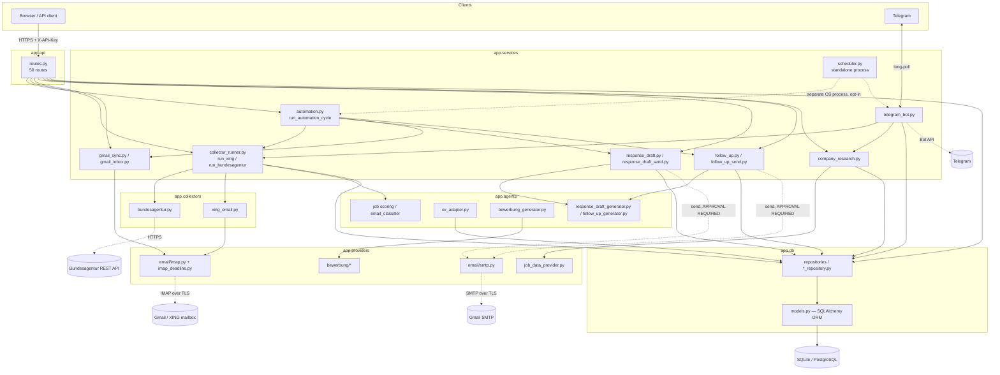

# Architecture — JobTriage (AI Job Search Control Center)

This document maps the system as it actually exists in the codebase at HEAD `f88b84a` (frozen `refactor/project-cleanup-r1`). It does not propose a redesign — see `docs/REFACTORING_BACKLOG.md` for deferred architectural changes.

## Layered overview

Solid arrows: normal call dependency. Dashed arrows: process boundary or external network/side-effect boundary.

## Layer responsibilities

| Layer | Responsibility | Depends on (verified via import scan) |
|---|---|---|
| `app/api` | FastAPI HTTP surface (`routes.py`, single file, 1860 lines, 50 routes). Auth + rate-limit wiring via `Depends()`. Translates domain exceptions to `HTTPException`. | everything below it; nothing imports back from `api`. |
| `app/services` | Orchestration/business logic: collector runs, Gmail sync, automation cycle, response-draft/follow-up generation-to-persistence flow and send flow, Telegram bot, standalone scheduler. | `agents`, `collectors`, `core`, `db`, `domain`, `models`, `providers`, `utils`. Never imports `api` or `security`. |
| `app/agents` | Deterministic, offline, template/rule-based generation and scoring (CV adaptation, application-letter generation, response-draft/follow-up content, job scoring, email classification). No LLM calls, no I/O. | `models`, `utils` only — deliberately isolated, no DB/provider/service imports. |
| `app/providers` | Pluggable I/O backends behind explicit interfaces: IMAP/SMTP email transport, bewerbung rendering backends, company-research/job-data provider contracts. | `db.models` (ORM, see AUD-015), `models`, `collectors` (see AUD-012 — circular). |
| `app/collectors` | Job-source ingestion: Bundesagentur REST API client, XING mailbox digest parser. | `models`, `providers` (see AUD-012 — circular). |
| `app/db` | SQLAlchemy ORM models + repository functions (query/insert/update, one repository module per aggregate). | `models`, `core`, `domain`, and — see AUD-014 — pure types from `services`/`agents`. |
| `app/security` | API key auth dependency, in-memory rate limiters. | `core` only. Clean leaf. |
| `app/core` | Settings (`pydantic-settings`), logging configuration. | `providers.email.base` for shared validation constants (see AUD-013 — inverted). Otherwise a leaf. |
| `app/domain` | Pure status-transition state machine (`status_transitions.py`). | `models` only. Clean leaf. |
| `app/models` | Pydantic DTOs/domain types (not ORM). | Nothing. Leaf. |
| `app/utils` | Small, generic, domain-free text helpers. | Nothing. Leaf. |

## External integrations

| Integration | Owning module | External surface | Read-only / side-effecting |
|---|---|---|---|
| Telegram bot (commands) | `app/services/telegram_bot.py` | Telegram Bot API (long-poll) | Side-effecting (can trigger collector runs, approvals) |
| Telegram notifications / daily digest | `app/services/telegram.py`, `app/services/telegram_digest.py` | Telegram Bot API (send) | Side-effecting (sends messages) |
| Gmail inbox sync | `app/services/gmail_inbox.py`, `app/services/gmail_sync.py` → `app/providers/email/imap.py` | Gmail IMAP | **Read-only** — fetch/parse/store only, never marks read/deletes/moves |
| Gmail response-draft send | `app/services/response_draft_send.py` → `app/providers/email/smtp.py` | Gmail SMTP | Side-effecting, **human-approval-gated** (no approval = no send, enforced in code) |
| Follow-up send | `app/services/follow_up_send.py` | Gmail SMTP | Side-effecting, **human-approval-gated**, thread-locked |
| Bundesagentur collector | `app/collectors/bundesagentur.py`, orchestrated by `app/services/collector_runner.py::run_bundesagentur` | Bundesagentur REST jobsuche API | Read-only external fetch; DB writes are the persisted side effect |
| XING email collector | `app/collectors/xing_email.py`, orchestrated by `app/services/collector_runner.py::run_xing` | XING mailbox via IMAP | Read-only IMAP fetch; **never follows links in email content** (hard security constraint, see module docstring) |
| Company Research | `app/services/company_research.py` | Pluggable provider — v1 makes **zero** outbound network requests (prior website-fetch feature was removed after an SSRF finding) | Side-effecting DB cache write, failure-isolated |
| Automation cycle | `app/services/automation.py::run_automation_cycle` | Composes the above — no direct external call itself | Side-effecting (drives collectors/Gmail/drafts/follow-ups) |
| Standalone scheduler | `app/scheduler.py` (`python -m app.scheduler`, separate OS process, opt-in) | None directly — ticks automation cycle + digest | Side-effecting; deliberately **not** started from the FastAPI lifespan (see below) |
| CV generation | `app/agents/cv_adapter.py` | None — pure transform | Persists a draft |
| Bewerbung (application letter) generation | `app/agents/bewerbung_generator.py`, `bewerbung_renderer.py`, `letter_content.py` | Pluggable provider (deterministic by default) | Persists a draft |
| Response draft / follow-up **generation** (content only) | `app/agents/response_draft_generator.py`, `app/agents/follow_up_generator.py` | None | Pure — sending is a separate, later-gated module |
| Human approval | `app/services/response_draft.py`, `app/services/follow_up.py`, `app/services/review_package.py` | None | DB state transition only — "never auto-approve" by design |

## Trust boundaries

- **Job-fact trust**: `TRUSTED_JOB_SOURCES = frozenset({"bundesagentur"})` (`app/services/response_draft.py`). Only structured-API-sourced job facts (`title`/`company`) may be interpolated into generated text; XING-sourced facts (parsed from unauthenticated inbound email) are treated as untrusted and never reach generated drafts.
- **Candidate-fact provenance**: every top-level candidate profile field carries a `field_trust`/`SourceType` (FACT / INFERENCE / IMPORTED / UNKNOWN); generation only consumes fields that pass `is_top_level_fact_usable_for_generation`.
- **Inbound email content**: never trusted as generation input beyond template-selection signals (language detection from subject/body). Never used as raw text in a draft.
- **XING tracking links**: `app/collectors/xing_email.py` has a hard, code-level constraint (zero HTTP client imports) against ever following a per-recipient tracking redirect embedded in a digest email.

## Transaction boundaries

- One SQLAlchemy `Session` per FastAPI request (`app/db/session.py::get_db`, generator dependency, closed in `finally`).
- The standalone scheduler opens and closes a fresh `SessionLocal()` per poll tick (`app/scheduler.py`), never holding a session across ticks.
- Multi-step automation operations (e.g. `run_automation_cycle`) compose several independently-committed repository calls rather than one giant transaction — each step is designed to be safely re-entrant/idempotent (CAS, unique constraints) rather than relying on one all-or-nothing transaction spanning external I/O (which would be unsafe anyway, since external calls can't be rolled back).

## External side-effect boundaries

- Read-only external calls (Gmail IMAP sync, Bundesagentur fetch, XING IMAP fetch) are isolated in `app/providers` / `app/collectors` and never mutate the source system.
- The only two code paths capable of sending real outbound email are `response_draft_send.py` and `follow_up_send.py`, both funneling through `app/providers/email/smtp.py`. No other module calls `smtplib` directly (verified).

## Persistence boundaries

- Every side-effecting service function persists through a repository module in `app/db/` — no service holds ad hoc in-memory business state across requests (per this project's implementation rules).
- Schema changes always ship with a matching Alembic migration (`alembic/versions/`, 30 files, single head `c7d3f9a1e5b8`).

## Human approval gates

- `ResponseDraftRecord.requires_human_review` is always `True` — Stage 7C only ever proposes.
- `send_response_draft` / `send_follow_up` both hard-require a persisted `*ApprovalRecord` with `decision == "APPROVED"` before any provider `send()` call — enforced in code, not just convention.
- `ReviewPackageService` never auto-approves candidate-profile changes.

## Concurrency-sensitive areas

- `AutomationRunRecord`: partial unique index (`UNIQUE(account_key) WHERE status='RUNNING'`, both SQLite and PostgreSQL dialect variants) + lease (`lease_holder`/`lease_expires_at`) renewed by a heartbeat thread.
- `AutomationScheduleRecord`: atomic `UPDATE ... WHERE next_run_at = :observed AND next_run_at <= :now` CAS claim — verified race-free under both dialects via dedicated integration tests.
- `TelegramDigestDeliveryRecord`: once-per-`(account_key, digest_date)` CAS with a terminal `UNCERTAIN` state for ambiguous outcomes (never auto-retried, to avoid duplicate sends).
- `ResponseDraftSendRecord` / `FollowUpApprovalRecord` / etc.: unique-constraint-based idempotency so re-running the same step never double-sends.

## Retry / idempotency-sensitive areas

- Automation steps (`run_due_cycle_if_claimed`) deliberately do **not** retry on `AutomationRunAlreadyInProgressError`/`AutomationRunLeaseLostError` — failures are logged and left for the next natural poll interval (no retry storms).
- IMAP/SMTP failures are classified retryable vs. permanent at the provider layer; retryable failures are never durably blamed on message content.
- Gmail message processing uses keyset pagination by `GmailMessageRecord.id` (monotonic, never resets) so a crash mid-scan resumes safely without reprocessing or skipping.

## Dependency-direction review (findings, not fixes)

The following layering issues were found via import-graph inspection. **None are implemented as fixes in this branch** — see `docs/REFACTORING_BACKLOG.md` and `docs/PRODUCTION_READINESS_AUDIT.md` (AUD-012 through AUD-015) for full detail and recommended direction:

1. **`app/providers` ↔ `app/collectors` circular import** (AUD-012) — `providers/email/{imap,smtp}.py` import `collectors.base.is_configured`; `collectors/xing_email.py` imports from `providers.email.*`. Currently harmless (module-cache masks it) but fragile.
2. **`app/core` imports `app/providers`** (AUD-013) — `core/config.py` pulls validation constants from `providers.email.base`, inverting the expected "core is foundational" direction.
3. **`app/db` imports `app/services`/`app/agents`** (AUD-014) — several repository modules import pure types/constants from the service layer above them.
4. **`app/providers` imports `app.db.models` (ORM)** (AUD-015) — couples provider contracts to persistence internals instead of `app/models` DTOs.

These are recorded as future backlog, not blockers — none of them currently cause a runtime defect.
