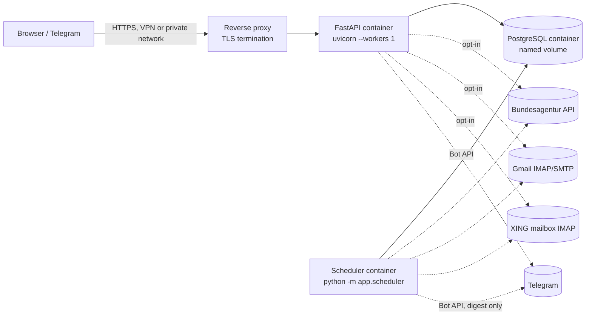

# Deployment Architecture — JobTriage

This document describes the **recommended initial deployment**: a single-server deployment, not a multi-worker/distributed one. See `docs/PRODUCTION_READINESS_AUDIT.md` for why multi-worker and public-internet exposure are not yet recommended (AUD-003, AUD-004).

## Target topology

## Why single-server, not distributed, first

The application's own design already assumes a single-server shape:
- The FastAPI process's lifespan **deliberately never starts the scheduler** (`app/main.py`, `app/scheduler.py` module docstring) — this avoids "N uvicorn workers → N schedulers."
- The in-memory rate limiter (`app/security/rate_limit.py`) is per-process (AUD-004) — safe only under a single FastAPI worker.
- Automation/scheduler overlap safety is enforced at the database level (lease + CAS), which tolerates multiple *instances* of the scheduler existing but only makes sense as **exactly one intended instance** in normal operation.

Scaling beyond single-server is future work requiring: a shared rate-limit store (Redis), reverse-proxy-aware client IP resolution, and re-validation of the lease/CAS design under real multi-instance load — none of which is implemented or claimed here.

## Scheduler strategy: Option A vs Option B

**Option A — single FastAPI worker with scheduler inside the same process.** Rejected. It would require changing `app/main.py`'s lifespan to start the scheduler loop, contradicting the codebase's own explicit, documented design decision **not** to do this (to keep the FastAPI process's worker count independent from "how many scheduler loops exist"). Implementing Option A would be an application-behavior change, out of scope for this deployment-only branch.

**Option B — web container + dedicated scheduler container/process. RECOMMENDED.** This matches what the code already does: `python -m app.scheduler` is a separate entrypoint, designed from the start to run as its own process, independent of how the web process is scaled. Chosen because:
1. Zero application code changes required — the separation already exists.
2. A crashed scheduler cannot take down the web API, and vice versa.
3. `docker compose` naturally expresses this as two services sharing one database.
4. It keeps "exactly one scheduler instance" an explicit deployment/orchestration guarantee (`replicas: 1`, no restart-storm auto-scaling) rather than something the app has to defend against itself — though the DB-level lease/CAS design means even an operator mistake (two scheduler containers) fails safe, not silently duplicated.

## Containers

| Service | Image | Purpose | Replicas |
|---|---|---|---|
| `db` | `postgres:16` (official) | Persistent state | 1 |
| `web` | built from this repo's `Dockerfile` | FastAPI app (`uvicorn app.main:app --workers 1`) | 1 |
| `scheduler` | same image, different command (`python -m app.scheduler`) | Automation cycle + Telegram digest ticks | 1 (must never be scaled) |

No reverse proxy container is included in `compose.yaml` by default — see "Reverse proxy / TLS" below for why that's left to the deployment environment rather than bundled.

## Ports

- `web`: exposes `8000` internally (uvicorn default); published to the host only if a reverse proxy isn't already handling external exposure, otherwise kept on the internal compose network.
- `db`: `5432`, not published to the host by default (only reachable by `web`/`scheduler` on the compose network) — reduces the accidental-exposure surface.
- `scheduler`: no listening port; outbound-only (DB, IMAP, SMTP, Bundesagentur, Telegram).

## Network

Single default `compose` bridge network. `web` and `scheduler` both reach `db` by service name (`db:5432`). No service other than `web` (and optionally a reverse proxy) should ever be reachable from outside the host.

## Persistent volumes

- Named volume for PostgreSQL data (`pgdata:/var/lib/postgresql/data`) — survives `docker compose down` (not `down -v`).
- No other persistent volume is required: the app has no `tempfile` usage (verified — AUD audit), and generated CV/Bewerbung content is stored in the database, not the filesystem.

## Database

- Production compose target is **PostgreSQL only** — SQLite is a local-dev/test convenience, not used in the compose file (per explicit instruction: "do not use SQLite in production compose").
- `DATABASE_URL` supplied via environment variable, e.g. `postgresql+psycopg://<user>:<password>@db:5432/<db>`; the `postgres` extra (`psycopg[binary]`) must be installed in the image (it is — see `docs/DOCKER.md`).

## Migration strategy

- `ALEMBIC_AUTO_UPGRADE` **must stay `false`** in this deployment (the app already defaults to this and documents it as a hard production rule — `app/db/session.py`).
- Migrations run as an **explicit, separate step**, before the `web`/`scheduler` containers start serving traffic: `docker compose run --rm web alembic upgrade head` (or an init container / CI/CD pipeline step). This makes migration failure loud and blocking rather than silently skipped or racily run once-per-worker.
- The Alembic head this project expects is `c7d3f9a1e5b8` — the same value the CI `scheduler-postgres` job asserts via `alembic current`.

## Secrets

- No secrets are baked into the image. All configuration (API key, IMAP/SMTP credentials, Telegram token, DB URL) is supplied via environment variables at container-run time — matching the existing `pydantic-settings` `Settings` model, which already reads exclusively from env/`.env`.
- `compose.yaml` reads secrets from a `.env` file (git-ignored) or the orchestrator's own secret-injection mechanism (Docker secrets, Kubernetes secrets, systemd `EnvironmentFile`, etc. — whichever the actual host environment provides). `.env.example` (already in the repo) documents every variable with a placeholder value; it must never contain real credentials.

## Health checks

- `db`: PostgreSQL's own `pg_isready` (already the pattern used in `.github/workflows/ci.yml`'s `scheduler-postgres` job) — reused verbatim in `compose.yaml`.
- `web`: a Docker `HEALTHCHECK`/compose healthcheck against the existing `GET /health` endpoint. **Caveat (AUD-002):** this endpoint currently does not check DB connectivity — a healthy HTTP response does not guarantee the app can actually reach the database. This is documented, not silently assumed; see `docs/TECHNICAL_DEBT.md` for the deferred fix (adding a dependency-aware health check is a public-API-shape change and is out of scope for this branch).
- `scheduler`: no HTTP surface to health-check; operational health is inferred from container "running" state plus log inspection (see `docs/RUNBOOK.md`) — a process-level `docker compose ps` check plus log-tailing is the practical signal here.

## Restart behavior

- `web` and `db`: `restart: unless-stopped` — recover automatically from a crash or host reboot, but don't fight an intentional `docker compose stop`.
- `scheduler`: `restart: on-failure`, deliberately **not** `unless-stopped`. Confirmed by local smoke test: `python -m app.scheduler` exits `0` (a clean, intentional exit, not an error) when both `AUTOMATION_SCHEDULER_ENABLED` and `TELEGRAM_DAILY_DIGEST_ENABLED` are `false` — with `unless-stopped` that clean exit would restart-loop forever; `on-failure` only restarts a genuine crash. When the scheduler is actually enabled, a restarted instance is safe by design (lease/CAS reconciliation, AUD-008's SIGTERM fix in this branch) even if it was mid-cycle when killed.
- `web` must not start accepting traffic before `db` is healthy — expressed via compose `depends_on: db: condition: service_healthy`.

## Backups

- Out of scope for this application to implement itself — standard PostgreSQL backup practice applies: `pg_dump`/`pg_basebackup` against the `db` container/volume, or the managed-Postgres provider's own backup mechanism if deployed there instead of a self-hosted container. See `docs/RUNBOOK.md` for a concrete backup/restore procedure sketch using the actual container names this compose file defines.

## Logging

- The app already emits structured JSON logs (`app/core/logging.py`) to stdout — this is container-native; no additional logging infrastructure is required for basic operation. Aggregate via the orchestrator's normal log-collection mechanism (`docker compose logs`, or a real log shipper in a more mature deployment) — not implemented or assumed here.

## Reverse proxy / TLS

- Not bundled in `compose.yaml` — TLS termination and the reverse proxy are treated as an environment-specific decision (a host-level Caddy/Nginx/Traefik instance, a cloud load balancer, or a VPN tunnel for fully private single-user use) rather than another moving part in this project's own compose file.
- **Important, and already flagged in the audit (AUD-003):** the in-memory rate limiter trusts `request.client.host` directly with no `X-Forwarded-For` awareness. Until that is fixed (deferred, security-relevant, reserved for Codex review), a reverse proxy in front of this app makes the rate limiter effectively see one client (the proxy) for all real users. Acceptable for a private, low-traffic, single-user/small-team deployment; **not** acceptable for public exposure.

## Rate-limit implications

See AUD-003/AUD-004/AUD-005 in the audit. Practical guidance for this deployment: keep the app behind a VPN or IP-allowlist rather than the open internet until the proxy-aware rate limiting fix lands, and run exactly one `web` replica (`--workers 1`, one container) so the configured rate limits mean what their numbers say.

## Scaling limitations (explicit, honest)

- **Not multi-worker safe today** (AUD-004): stay at `--workers 1` / one `web` container.
- **Not designed for public internet exposure today** (AUD-002, AUD-003, AUD-006): keep it behind a private network / VPN / allowlist.
- **PostgreSQL production use is not yet field-tested by the author** (AUD-011) — CI proves migrations and concurrency correctness, but this compose target has not yet run as a long-lived production workload; treat an initial rollout as monitored, not "fire and forget."
- The `scheduler` service must never be scaled beyond 1 replica — DB-level lease/CAS makes extra instances merely redundant rather than harmful, but there's no reason to run more than one.
